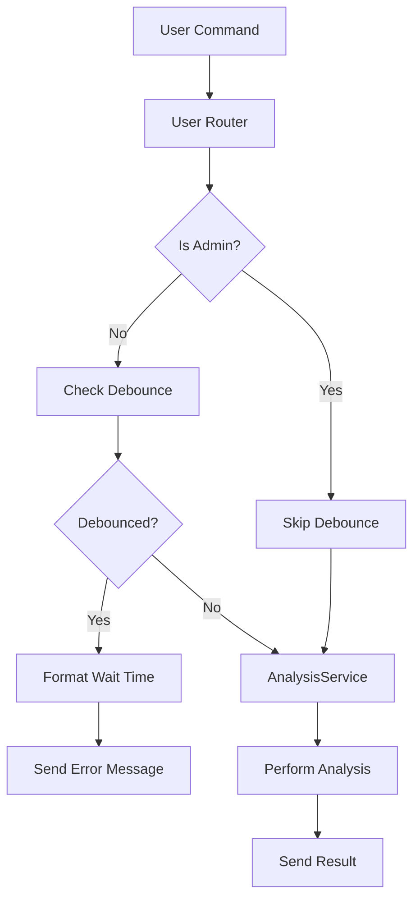

# Design Document

## Overview

This design extends the Telegram Analytics Bot to support user-initiated analysis commands (`/anal` and `/deep_anal`) with configurable time periods, shared chat-level debounce protection, and human-readable wait time formatting. The implementation leverages existing architecture patterns (routers, services, repositories) and reuses components like `AnalysisService`, `DebounceManager`, and `MessageFormatter`.

## Architecture

### High-Level Flow

```
User → /anal or /deep_anal command
  ↓
User Router (new) → validates chat type & admin bypass
  ↓
AnalysisService → checks debounce (chat-level)
  ↓
  ├─ Debounced? → Format wait time → Return error message
  └─ Not debounced? → Perform analysis → Send result
```

### Component Interaction



## Components and Interfaces

### 1. User Router (New)

**File:** `bot/routers/user_router.py`

**Purpose:** Handle user-initiated analysis commands with debounce protection and admin bypass.

**Key Methods:**

```python
async def cmd_anal(
    message: Message,
    analysis_service: AnalysisService,
    config: Config
) -> None:
    """
    Handle /anal command for short-term analysis.
    
    - Validates command is from group chat
    - Checks if user is admin (bypass debounce)
    - Calls analysis service with ANAL_PERIOD_HOURS
    - Handles debounce errors with formatted wait time
    """

async def cmd_deep_anal(
    message: Message,
    analysis_service: AnalysisService,
    config: Config
) -> None:
    """
    Handle /deep_anal command for extended analysis.
    
    - Validates command is from group chat
    - Checks if user is admin (bypass debounce)
    - Calls analysis service with DEEP_ANAL_PERIOD_HOURS
    - Handles debounce errors with formatted wait time
    """

def create_user_router(config: Config) -> Router:
    """Create and configure user router with command handlers."""
```

**Design Decisions:**
- Separate router for user commands to maintain clear separation from admin commands
- Reuse existing `AnalysisService` for consistency
- Admin bypass implemented at router level before service call
- Chat type validation ensures commands only work in groups

### 2. Configuration Updates

**File:** `config/settings.py`

**New Fields:**

```python
@dataclass
class Config:
    # ... existing fields ...
    
    # User analysis periods
    anal_period_hours: int  # Default: 6
    deep_anal_period_hours: int  # Default: 12
```

**Environment Variables:**
- `ANAL_PERIOD_HOURS` (default: 6)
- `DEEP_ANAL_PERIOD_HOURS` (default: 12)

### 3. AnalysisService Updates

**File:** `services/analysis_service.py`

**New Method:**

```python
async def analyze_messages_with_debounce(
    self,
    hours: int,
    chat_id: int,
    user_id: int,
    operation_type: str,
    bypass_debounce: bool = False
) -> tuple[str, bool]:
    """
    Analyze messages with chat-level debounce protection.
    
    Args:
        hours: Analysis period in hours
        chat_id: Chat ID for analysis and debounce tracking
        user_id: User ID for logging
        operation_type: Operation identifier (e.g., "anal", "deep_anal")
        bypass_debounce: If True, skip debounce check (for admin)
        
    Returns:
        Tuple of (analysis_result, from_cache)
        
    Raises:
        ValueError: If debounced with remaining time in seconds
    """
```

**Design Decisions:**
- New method wraps existing `analyze_messages` with chat-level debounce
- Operation type includes chat_id for per-chat tracking
- Returns remaining seconds in ValueError for formatting at router level
- Existing admin `/analyze` command continues using original method

### 4. DebounceManager Updates

**File:** `utils/debounce_manager.py`

**Updated Methods:**

```python
async def can_execute(
    self,
    operation: str,
    interval_seconds: int
) -> tuple[bool, float]:
    """
    Check if operation can execute and return remaining time.
    
    Returns:
        Tuple of (can_execute, remaining_seconds)
    """

async def get_remaining_time(
    self,
    operation: str,
    interval_seconds: int
) -> float:
    """
    Get remaining debounce time in seconds.
    
    Returns:
        Remaining seconds, or 0 if not debounced
    """
```

**Design Decisions:**
- Enhanced to return remaining time for better error messages
- Maintains backward compatibility with existing usage
- Operation key format: `{operation_type}:{chat_id}`

### 5. Message Formatter Updates

**File:** `utils/message_formatter.py`

**New Method:**

```python
@staticmethod
def format_debounce_wait_time(seconds: float) -> str:
    """
    Format remaining debounce time in human-readable format.
    
    Args:
        seconds: Remaining time in seconds
        
    Returns:
        Formatted string like "2 ч 30 мин 15 сек" or "45 мин 30 сек"
        
    Examples:
        - 9015 seconds → "2 ч 30 мин 15 сек"
        - 2730 seconds → "45 мин 30 сек"
        - 45 seconds → "45 сек"
    """
```

**Design Decisions:**
- Omits zero components (e.g., no "0 ч" if less than 1 hour)
- Always shows at least seconds
- Uses Russian abbreviations: ч (hours), мин (minutes), сек (seconds)

### 6. Bot Main Updates

**File:** `bot/main.py`

**Changes:**
- Import and register `user_router`
- Add router to dispatcher: `dp.include_router(user_router)`

## Data Models

### Debounce Record

**Existing Model:** `database/models.py` - `DebounceModel`

```python
@dataclass
class DebounceModel:
    operation: str  # Format: "anal:{chat_id}" or "deep_anal:{chat_id}"
    last_execution: datetime
```

**Key Format Examples:**
- `/anal` in chat -1001234567890: `"anal:-1001234567890"`
- `/deep_anal` in chat -1001234567890: `"deep_anal:-1001234567890"`

**Design Decisions:**
- Reuse existing debounce table and model
- Composite operation key includes chat_id for per-chat tracking
- No schema changes required

## Error Handling

### Debounce Error Flow

```python
try:
    result, from_cache = await analysis_service.analyze_messages_with_debounce(
        hours=config.anal_period_hours,
        chat_id=message.chat.id,
        user_id=message.from_user.id,
        operation_type="anal",
        bypass_debounce=is_admin
    )
except ValueError as e:
    # Extract remaining seconds from exception
    remaining_seconds = extract_seconds_from_error(str(e))
    wait_time = MessageFormatter.format_debounce_wait_time(remaining_seconds)
    await message.answer(f"⏳ Анализ был выполнен недавно. Подождите {wait_time}.")
    return
```

### Chat Type Validation

```python
if message.chat.type not in [ChatType.GROUP, ChatType.SUPERGROUP]:
    logger.debug(f"Ignoring command from non-group chat: {message.chat.type}")
    return  # Silently ignore
```

### Admin Bypass

```python
is_admin = message.from_user.id == config.admin_id
if is_admin:
    logger.debug("Admin user detected, bypassing debounce")
    bypass_debounce = True
```

## Testing Strategy

### Unit Tests

**File:** `tests/unit/test_user_router.py`

Test cases:
1. `/anal` command with valid request
2. `/deep_anal` command with valid request
3. Debounce rejection with formatted wait time
4. Admin bypass of debounce
5. Command ignored in private chat
6. Configuration loading for new env vars

**File:** `tests/unit/test_message_formatter.py`

Test cases:
1. Format wait time with hours, minutes, seconds
2. Format wait time with only minutes and seconds
3. Format wait time with only seconds
4. Edge cases (0 seconds, very large values)

**File:** `tests/unit/test_debounce_manager.py`

Test cases:
1. Chat-level debounce tracking
2. Different chats don't interfere
3. Different operation types don't interfere
4. Remaining time calculation

### Integration Tests

**File:** `tests/integration/test_user_analysis_flow.py`

Test scenarios:
1. End-to-end `/anal` command execution
2. End-to-end `/deep_anal` command execution
3. Debounce enforcement across multiple users in same chat
4. Admin bypass in real scenario
5. Configuration override via environment variables

## Configuration Examples

### .env File

```bash
# User analysis periods
ANAL_PERIOD_HOURS=6
DEEP_ANAL_PERIOD_HOURS=12

# Existing debounce setting (applies to user commands)
DEBOUNCE_INTERVAL_SECONDS=300  # 5 minutes
```

### .env.example Update

Add documentation for new variables:

```bash
# User Analysis Commands
ANAL_PERIOD_HOURS=6              # Time period for /anal command (hours)
DEEP_ANAL_PERIOD_HOURS=12        # Time period for /deep_anal command (hours)
```

## Security Considerations

1. **Rate Limiting:** Debounce prevents spam and API cost abuse
2. **Admin Privilege:** Admin bypass allows emergency analysis without waiting
3. **Chat Isolation:** Debounce per chat prevents cross-chat interference
4. **Input Validation:** Chat type validation prevents misuse in private chats
5. **Error Messages:** Don't expose internal state, only user-friendly wait times

## Performance Considerations

1. **Caching:** Reuse existing cache mechanism to reduce OpenAI API calls
2. **Database Queries:** Debounce check is single query by operation key
3. **Message Formatting:** Wait time calculation is O(1) arithmetic
4. **Async Operations:** All I/O operations remain non-blocking

## Migration Path

1. **Phase 1:** Add configuration fields and validation
2. **Phase 2:** Implement message formatter for wait time
3. **Phase 3:** Update debounce manager with remaining time support
4. **Phase 4:** Create user router with command handlers
5. **Phase 5:** Update analysis service with new method
6. **Phase 6:** Register user router in bot main
7. **Phase 7:** Update .env.example with documentation

No database migrations required - existing schema supports the design.

## Backward Compatibility

- Existing admin commands remain unchanged
- Existing debounce mechanism enhanced but compatible
- New configuration fields have sensible defaults
- No breaking changes to existing functionality
